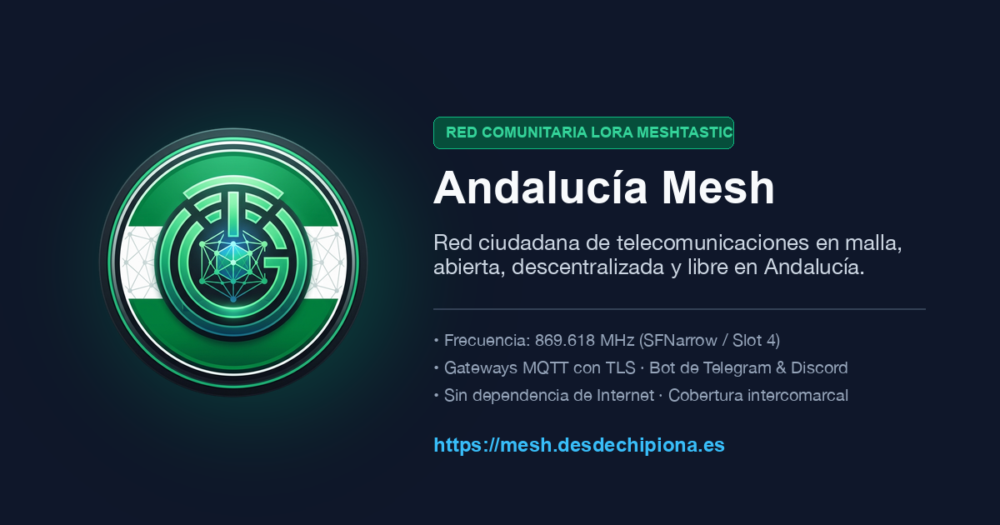
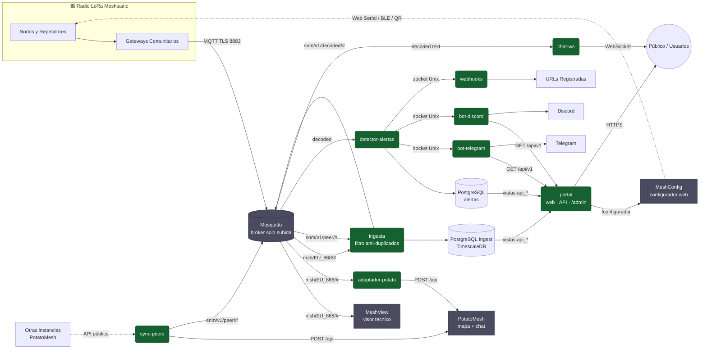
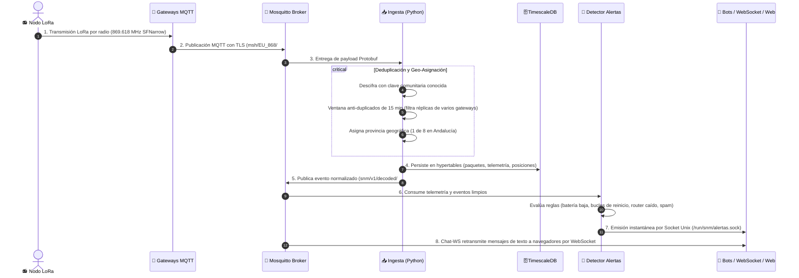
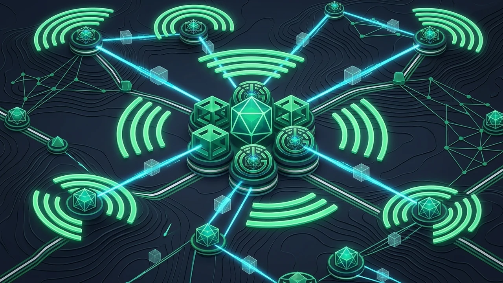
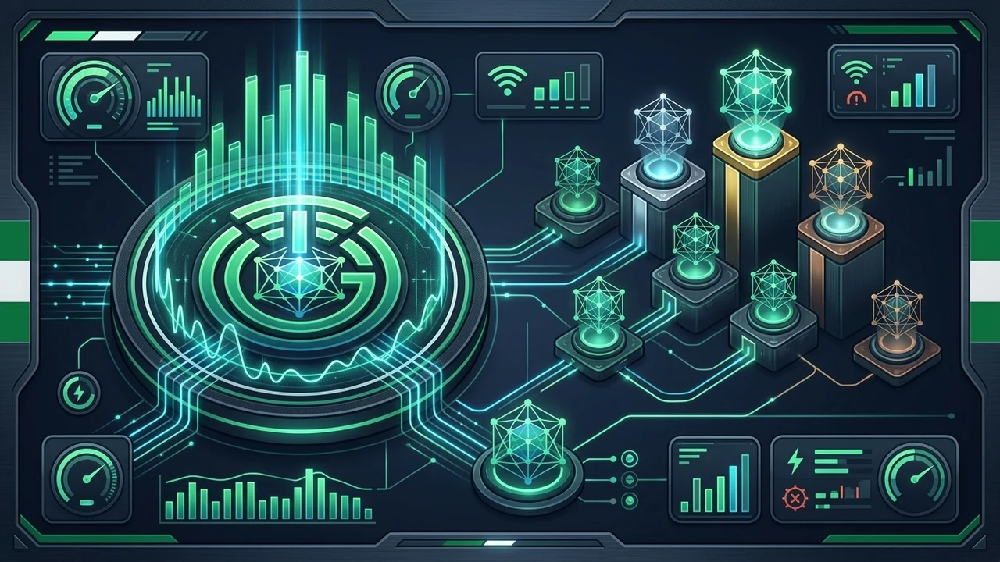

<div align="center">



# 📡 Andalucía Mesh

**Ecosistema integral de servicios, analítica, monitorización y portal web para redes comunitarias LoRa ([Meshtastic](https://meshtastic.org)).**

*Cádiz como foco · Andalucía como alcance · Diseñado para ser 100% abierto y replicable por cualquier comunidad.*

[](docs/info/README.md)
[](docs/info/infrastructure/README.md)
[](docs/info/infrastructure/02-postgresql.md)
[](docs/info/portal/README.md)
[](services/)
[](docs/info/mosquitto/README.md)
[-007A33?style=for-the-badge&logo=shield&logoColor=white)](docs/info/business-rules.md)
[](docs/info/portal/README.md#21-soporte-multidioma-rn-48)

</div>

---

## 🧭 ¿De qué va el proyecto?

**Meshtastic** permite crear redes de radio malladas en la banda libre de **868 MHz** sin depender de Internet, cobertura móvil ni cables. Los nodos retransmiten paquetes entre sí de forma colaborativa, creando una infraestructura descentralizada y resistente a emergencias.

A medida que una red regional crece hasta abarcar cientos de usuarios, repetidores en cumbres estratégicas y enlaces interurbanos, surgen retos críticos:
- ¿Cómo saber qué zonas tienen cobertura real sin saturar el canal de radio?
- ¿Cómo detectar anomalías antes de que degraden la red (nodos en bucle de reinicio, saturación, pérdida de routers clave o baterías críticas)?
- ¿Cómo ayudar a los nuevos miembros a configurar su equipo con los parámetros oficiales en 1 solo clic?

**Andalucía Mesh** resuelve estos desafíos integrando en una única plataforma modular la recepción de telemetría de gateways comunitarios, el análisis técnico en tiempo real, el almacenamiento temporal eficiente, la detección proactiva de incidentes y un portal público accesible, moderno y **100% respetuoso con la privacidad**.

> [!NOTE]
> **Enfoque territorial y universal:** El proyecto nació con foco en la provincia de Cádiz y cobertura coordinada en las 8 provincias andaluzas (*Almería, Cádiz, Córdoba, Granada, Huelva, Jaén, Málaga y Sevilla*). Sin embargo, toda la arquitectura es **completamente agnóstica**: cualquier comunidad o región puede clonar el repositorio, configurar sus variables en `.env` y disponer de su propia infraestructura en minutos.

---

## 🏛️ Los 4 Pilares del Ecosistema

| Pilar | Qué aporta al usuario y a la comunidad | Tecnologías clave |
|---|---|---|
| 🗺️ **Visualización en Vivo y Topología** | Mapas interactivos de cobertura, salas de chat público por radio y visor técnico de rutas, saltos de paquetes y niveles de señal (RSSI/SNR). | [PotatoMesh](docs/info/potatomesh/README.md), [MeshView](docs/info/meshview/README.md), SVG Provincial |
| 📊 **Ingesta Inteligente y Métricas** | Decodificación Protobuf, deduplicación temporal estricta (15 min), geo-clasificación provincial automática, series temporales y cálculo de saturación de canal ponderada. | Python 3.13, PostgreSQL 17 + TimescaleDB |
| 🚨 **Vigilancia y Alertas Proactivas** | Motor de reglas para detectar caídas de repetidores, bucles de reinicio, saturación de canal, telemetría agresiva y niveles de batería en riesgo (routers y clientes), con difusión instantánea a Telegram, Discord y Webhooks. | Socket Unix, Python AsyncIO, HMAC SHA-256 |
| 🛠️ **Autonomía y Facilitación al Usuario** | Configurador Web interactivo con Web Serial (USB) y Web Bluetooth (BLE), importación por QR en la app oficial de Meshtastic, presets YAML oficiales y diagnóstico de nodo instantáneo. | Web Serial API, Web BLE, Laravel 13 + Filament 5 |

---

## 🗺️ Mapa de Arquitectura del Sistema

El sistema separa estrictamente los componentes: los gateways de la comunidad envían exclusivamente telemetría por MQTT seguro (*solo subida; nada vuelve a la radio para no saturar el medio físico*). A partir de ahí, los servicios propios ingieren, limpian, analizan y difunden los datos:



<div align="center">
  <span style="color:#15612F; font-weight:bold;">🟩 Verde:</span> Desarrollo propio del proyecto &nbsp;·&nbsp;
  <span style="color:#4A4B5E; font-weight:bold;">⬛ Gris:</span> Integración de software abierto de terceros (se configura y orquesta, no se bifurca)
</div>

---

## ⚡ Ciclo de Vida de una Transmisión (Data Pipeline)

¿Cómo viaja un paquete de radio desde que un nodo lo emite hasta que aparece en el mapa o genera una alerta en Telegram? El siguiente diagrama describe el flujo cronológico paso a paso:



---

## 📸 Galería Visual del Ecosistema

<div align="center">

|  |  |
| :---: | :---: |
| **PotatoMesh** · Mapa interactivo de nodos y chat en vivo | **MeshView** · Análisis técnico de paquetes, RSSI/SNR y saltos |
|  |  |
| **Revisa tu nodo** · Diagnóstico de salud y cobertura en 1 clic | **Rankings** · Estadísticas de actividad y saturación de canal |

</div>

---

## 🧩 Catálogo de Piezas y Componentes

El proyecto se compone de **9 desarrollos propios** y **4 integraciones de terceros** perfectamente coordinadas:

### 1. Infraestructura y Red Base
- **Servidor y Contenedores:** Servidor Debian 12/13 con Docker y Docker Compose.
- **Nginx Nativo:** Servidor web frontal que gestiona certificados SSL (Let's Encrypt / Certbot), proxy inverso hacia contenedores, terminación TLS MQTT (puerto 8883) y conexiones WebSocket.
- **PostgreSQL 17 + TimescaleDB Nativo:** Motor de base de datos relacional y de series temporales. Aislamiento estricto: una base de datos y un rol de usuario por servicio.
- 📁 Directorio: [`infrastructure/`](infrastructure/) · 📖 Documentación: [Infraestructura](docs/info/infrastructure/README.md)

### 2. Mensajería y Recepción (Broker MQTT)
- **Mosquitto:** Broker MQTT Eclipse Mosquitto con puertos 1883 (interno Docker) y 8883 (TLS para gateways públicos).
- **Control de Acceso (ACL):** Cada gateway dispone de credenciales exclusivas. Política estricta de **solo subida** (`msh/EU_868/#`); los gateways nunca reciben tráfico de vuelta para evitar bucles hacia la radio.
- 📁 Directorio: [`integrations/mosquitto/`](integrations/mosquitto/) · 📖 Documentación: [Mosquitto](docs/info/mosquitto/README.md)

### 3. Ingesta, Deduplicación y Telemetría
- **Servicio `ingesta`:** Desarrollado en Python 3.13 con `asyncio` y `aiomqtt`.
  - Decodifica los mensajes Protobuf oficiales de Meshtastic.
  - Implementa un filtro anti-duplicados con ventana deslizante de 15 minutos (un mismo paquete de radio captado por 5 gateways solo se computa una vez).
  - Asigna provincia geográfica automáticamente mediante coordenadas GPS o histórico del nodo.
  - Persiste métricas en hypertables de TimescaleDB con políticas de retención continua.
  - Publica un flujo de paquetes normalizados en `snm/v1/decoded/#`.
- 📁 Directorio: [`services/ingesta/`](services/ingesta/) · 📖 Documentación: [Ingesta](docs/info/ingesta/README.md)

### 4. Visualización y Topología
- **MeshView:** Visor técnico para depuración avanzada de paquetes de radio, rutas seguidas, niveles de señal y nodos escuchados.
- **PotatoMesh:** Mapa comunitario en tiempo real y cliente de chat web.
- **`adaptador-potato`:** Servicio propio en Python que puentea los paquetes MQTT hacia la API interna de PotatoMesh.
- **`sync-peers`:** Servicio propio que consulta periódicamente APIs públicas de instancias vecinas para intercambiar telemetría y enriquecer el mapa regional sin duplicar tráfico.
- 📁 Directorios: [`integrations/meshview/`](integrations/meshview/), [`integrations/potatomesh/`](integrations/potatomesh/), [`services/adaptador-potato/`](services/adaptador-potato/), [`services/sync-peers/`](services/sync-peers/)

### 5. Portal Web Comunitario, API y Configurador
- **Aplicación Web:** Construida con **Laravel 13** y **Filament 5** en PHP 8.5.
  - **Zero-Cookies (RN-06):** Navegación pública 100% anónima sin cookies de sesión, analíticas invasivas ni avisos molestos.
  - **Soporte Multidioma (RN-48):** Detección automática y conmutador visual en cabecera con soporte completo en Español (bandera andaluza), Inglés y Portugués.
  - **Mapa SVG de Andalucía:** Mapa interactivo por provincias con cálculo de saturación ponderada de canal (`ROUTER` 60%, `CLIENT` 40%) y selector de ventana temporal (**30m** por defecto, 1h, 6h, 12h, 1d, 7d).
  - **Supervisión de Infraestructura y Routers (`/routers`):** Monitorización pública de repetidores y routers con selector de ámbito territorial (Andalucía, España, Ambos), KPIs de ocupación de canal (ChUtil, TX) y estado energético (batería/red eléctrica) en tiempo real.
  - **Rankings y Salud de la Red (`/rankings`):** Monitorización de nodos en peligro, consumo de red por tiempo de aire y catálogo de 11 rankings técnicos para supervisión comunitaria (cobertura de gateways, enlaces directos, salud solar nocturna).
  - **Alertas e Incidencias (`/alertas`, `/alertas/{id}`):** Catálogo público de incidencias detectadas en la malla con filtrado interactivo por severidad, temática y provincia.
  - **Artículos y Guías Comunitarias (`/paginas`, `/paginas/{slug}`):** Catálogo editorial con tarjetas visuales, metadatos SEO enriquecidos (Article schema) y gestión desde el panel de administración.
  - **Configurador Web (`/configurador`):** Herramienta cliente para configurar nodos vía Web Serial (USB) y Web Bluetooth (BLE), con códigos QR para la app móvil y presets YAML descargables basados en el estándar oficial **SFNarrow**.
  - **Revisa tu nodo (`/revisa-tu-nodo`):** Diagnóstico instantáneo de salud, telemetría y calidad de conexión para cualquier nodo de la red introduciendo su ID.
  - **Catálogo de Hardware (`/hardware`):** Directorio interactivo de dispositivos recomendados (Heltec, RAK Wireless, LilyGO, SenseCAP), antenas y recomendaciones de montaje solar.
  - **API Pública REST v1 (`/api/v1`):** Endpoints JSON cacheados de solo lectura (`/stats`, `/provinces`, `/nodes`, `/alerts`, `/rankings`).
  - **Panel de Operadores (`/admin`):** Gestión técnica con Filament 5, autenticación obligatoria con segundo factor TOTP (2FA), monitorización reactiva de los 13 servicios y terminal interactiva de gestión de routers remotos.
- 📁 Directorios: [`services/portal/`](services/portal/), [`integrations/meshconfig/`](integrations/meshconfig/) · 📖 Documentación: [Portal](docs/info/portal/README.md), [MeshConfig](docs/info/meshconfig/README.md)

### 6. Alertas en Tiempo Real y Notificaciones
- **`detector-alertas`:** Servicio autónomo en Python 3.13 que evalúa continuamente el flujo `snm/v1/decoded/#` frente a reglas de salud:
  - Bucles de reinicio rápido (nodos inestables).
  - Nivel de riesgo y baterías críticas (diferenciando infraestructura solar vs clientes).
  - Routers troncales caídos o sin respuesta.
  - Saturación del canal de radio (ChUtil ponderado).
  - Emisiones excesivas y sondeos agresivos (spam de mensajes, NodeInfo, posición o paquetes cifrados).
  - Saltos de paquete agotados (mala planificación de topología).
- **Socket Unix (`/run/snm/alertas.sock`):** Canal de comunicación ultrarrápido y seguro entre el detector y los notificadores.
- **`bot-telegram` & `bot-discord`:** Bots interactivos que publican alertas inmediatas con filtros provinciales configurables y responden a comandos de consulta (`/status`, `/rankings`, `/nodos`, `/alertas`, `/routers`).
- **`webhooks`:** Emisión de eventos firmados mediante HMAC SHA-256 hacia servidores externos de operadores.
- **`chat-ws`:** Pasarela WebSocket de solo lectura para conectar el chat de radio en directo con la interfaz web.
- 📁 Directorios: [`services/detector-alertas/`](services/detector-alertas/), [`services/bot-telegram/`](services/bot-telegram/), [`services/bot-discord/`](services/bot-discord/), [`services/webhooks/`](services/webhooks/), [`services/chat-ws/`](services/chat-ws/)

---

## 📻 Estándar Oficial de Radio: SFNarrow Andalucía

Para garantizar el máximo alcance geográfico y minimizar las colisiones en el espectro radioeléctrico, Andalucía Mesh adopta y promueve el estándar **SFNarrow**:

| Parámetro | Valor Oficial | Justificación |
|---|---|---|
| **Región** | `EU_868` | Frecuencia libre para radiocomunicaciones en la Unión Europea. |
| **Frecuencia / Slot** | `869.61875 MHz` (Slot 4 / Canal 4) | Frecuencia de uso común coordinada regionalmente. |
| **Preset de Módem** | **SFNarrow** | Ancho de banda reducido (62.5 kHz) con SF7 y CR 4/5 para máxima sensibilidad sin saturar el espectro. |
| **Canal Primario (Slot 0)** | `SFNarrow` con PSK por defecto (`AQ==`) | Facilita la interoperabilidad y el descubrimiento entre nodos. |
| **Canales Secundarios** | Canales provinciales (`Cadiz`, `Sevilla`, etc.) | Tráfico zonal sin colisionar con el canal autonómico general. |
| **Potencia TX** | `27 dBm` (o `8 dBm` si dispone de amplificador externo PA) | Cumplimiento estricto del límite legal europeo ERP. |
| **Límite de Saltos (Hops)** | `3` para `CLIENT` / `4` para `CLIENT_MUTE` | Previene tormentas de retransmisión en la malla. |
| **Buenas Prácticas** | NodeInfo cada 72h · Posición cada 6h (móvil) o 72h (fijo) | Telemetría desactivada por defecto salvo nodos meteorológicos autorizados. |

---

## 🛠️ Pila Tecnológica

| Capa | Tecnologías |
|---|---|
| **Infraestructura** | Debian 12/13, Docker, Docker Compose, Nginx, Let's Encrypt / Certbot |
| **Bases de Datos** | PostgreSQL 17 nativo, extensión TimescaleDB para series temporales |
| **Mensajería** | Eclipse Mosquitto MQTT (TLS 8883), WebSocket nativo, Unix Domain Sockets |
| **Backend Portal** | PHP 8.5, Laravel 13, Filament 5, Spatie Sitemap |
| **Frontend Portal** | Blade, Tailwind CSS v4, JavaScript Vanilla / Vite, SVG interactivo |
| **Servicios Núcleo** | Python 3.13, AsyncIO, aiomqtt, uv, Pydantic, Protobuf de Meshtastic |
| **Herramientas Cliente** | Web Serial API, Web Bluetooth API (BLE), QRCode.js, js-yaml |

---

## 🚀 Despliegue y Puesta en Marcha

El despliegue está completamente paquetizado y orquestado mediante Docker Compose, aprovechando servicios nativos en el anfitrión para maximizar el rendimiento:

### 1. Requisitos del Sistema
- Servidor dedicado o VPS con Debian 12 o 13.
- Mínimo recomendado: 2 vCPU, 4 GB de memoria RAM, 40 GB de almacenamiento SSD.
- Puertos públicos requeridos: `80/tcp` (HTTP/ACME), `443/tcp` (HTTPS/WSS), `8883/tcp` (MQTT seguro con TLS).

### 2. Orden de Despliegue Secuencial
El sistema cuenta con dependencias ordenadas por niveles. El script [`infrastructure/deploy.sh`](infrastructure/deploy.sh) y [`infrastructure/check-compose.sh`](infrastructure/check-compose.sh) facilitan el proceso:

```text
1. Infraestructura (Docker, Nginx, PostgreSQL 17 + TimescaleDB)
   └── 2. Mosquitto (Broker MQTT, creación de usuarios y ACLs)
       └── 3. MeshView & PotatoMesh (+ adaptador-potato y sync-peers)
           └── 4. Ingesta (Filtro anti-duplicados, decodificación Protobuf)
               └── 5. Portal Web (Laravel 13 + Filament 5 + MeshConfig)
                   └── 6. Detector de Alertas (Reglas de anomalía y socket Unix)
                       └── 7. Bots & Webhooks (Telegram, Discord, HTTP firmado)
                           └── 8. Chat-WS (WebSocket público de radio en tiempo real)
```

Para instrucciones detalladas de configuración de variables de entorno y comandos de despliegue, consulta la guía paso a paso en [docs/info/deployment.md](docs/info/deployment.md).

---

## 📚 Directorio de Documentación

La documentación canónica y viva del proyecto se encuentra en [`docs/info/`](docs/info/):

| Documento | Contenido y Propósito |
|---|---|
| [📖 Índice Maestro](docs/info/README.md) | Catálogo completo de módulos y estado de implementación |
| [🧭 Visión General](docs/info/overview.md) | Fundamentos, decisiones, estimación de recursos y descartes |
| [📜 Reglas de Negocio](docs/info/business-rules.md) | Objetivos irrenunciables, privacidad, límites y comportamiento |
| [🗺️ Mapa de Arquitectura](docs/info/architecture-map.md) | Diagrama conceptual y canales de comunicación entre piezas |
| [🤝 Contrato de Integración](docs/info/integration.md) | Especificación de hosts, puertos, formatos JSON, topics y vistas SQL |
| [🚀 Guía de Despliegue](docs/info/deployment.md) | Fases, requisitos y pruebas de verificación paso a paso |
| [⚖️ Decisiones Técnicas](docs/info/decisiones-tecnicas.md) | Decisiones deliberadas del sistema y justificación de arquitectura |
| [🎨 Sistema de Diseño (Portal)](docs/info/DESIGN.md) | Tokens de diseño, colores institucionales, tipografías y reglas de interfaz |
| [💻 Catálogo de Comandos](docs/info/commands.md) | Scripts de mantenimiento, migraciones, pruebas y operaciones |
| [🤖 Normas de Colaboración](AGENTS.md) | Protocolo operativo obligatorio para desarrolladores y agentes de IA |

---

## 🗂️ Estructura del Repositorio

```text
.
├── infrastructure/              # Host, Nginx, PostgreSQL, scripts de despliegue y comprobación
├── integrations/
│   ├── meshconfig/              # Configurador web Meshtastic (Web Serial, BLE, QR, YAML)
│   ├── meshview/                # Visor técnico de paquetes de radio y rutas
│   ├── mosquitto/               # Broker MQTT, contraseñas y listas de control de acceso (ACL)
│   └── potatomesh/              # Mapa comunitario y sala de chat web
├── services/
│   ├── adaptador-potato/        # Puente entre MQTT y la API de PotatoMesh
│   ├── bot-discord/             # Bot de notificaciones y comandos para Discord
│   ├── bot-telegram/            # Bot de notificaciones y comandos para Telegram
│   ├── chat-ws/                 # Servidor WebSocket para chat de radio en tiempo real
│   ├── detector-alertas/        # Motor de detección de anomalías y socket de alertas
│   ├── ingesta/                 # Decodificación Protobuf, deduplicación y persistencia
│   ├── portal/                  # Portal web (Laravel 13, Filament 5, API REST v1)
│   ├── sync-peers/              # Sincronización e intercambio con instancias vecinas
│   └── webhooks/                # Emisión de eventos HTTP firmados con HMAC SHA-256
└── docs/
    ├── apis/                    # Especificaciones de APIs de terceros
    └── info/                    # Documentación técnica canónica y viva del proyecto
```

---

## 🤝 Comunidad y Filosofía

Andalucía Mesh es una iniciativa ciudadana, sin ánimo de lucro y comprometida con el software libre y la privacidad:
- **Sin rastreo ni publicidad:** No utilizamos cookies de terceros, píxeles de seguimiento ni analíticas comerciales.
- **Transparencia tecnológica:** Todo el código fuente y las configuraciones son públicos y auditables.
- **Resiliencia cívica:** Creemos en las telecomunicaciones libres como un bien común para conectar personas, entornos rurales y situaciones de emergencia.

---

## ✍️ Autoría y Licencia

Creado e impulsado por **Raúl Caro Pastorino**  
Sitio web: [raupulus.dev](https://raupulus.dev) · Perfil: [@raupulus](https://github.com/raupulus) · Contacto público: [public@raupulus.dev](mailto:public@raupulus.dev)

Distribuido bajo licencia de código abierto para la comunidad.
