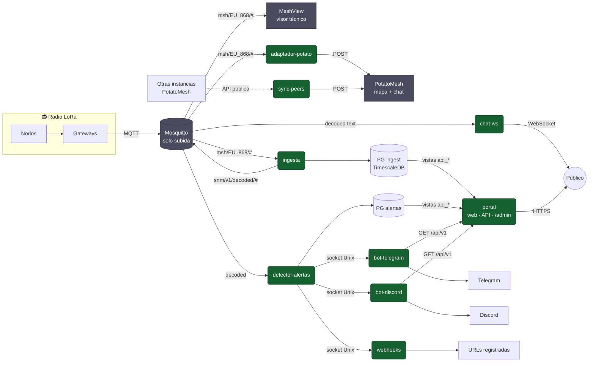

<div align="center">

# 📡 Andalucía Mesh

**Portal, estadísticas, alertas y servicios para una malla LoRa (Meshtastic) regional**

Cádiz como foco · Andalucía como alcance · reutilizable por cualquier comunidad


</div>

---

## 🧭 Qué es

Los gateways de la comunidad suben por MQTT lo que oyen por radio a un servidor propio. Con esos datos el proyecto:

| | |
|---|---|
| 🗺️ **Enseña la malla** | Mapa y chat en vivo (PotatoMesh), visor técnico (MeshView), mapa por provincias y chat en directo por WebSocket |
| 📊 **La mide** | Nodos por provincia, saturación del canal, rankings por hora, día, semana y mes, consumo de red por nodo |
| 🚨 **La protege** | Detecta reinicios en bucle, baterías bajas, routers caídos, spam o malas configuraciones y avisa por Telegram, Discord y webhooks |
| 🛠️ **Ayuda a configurarla** | Guía de configuración, alta de gateways, diagnóstico de cada nodo y enlaces de firmware |

Todo lo que depende de cada instancia (nombre, dominio, contacto, canales, radio, mapa) va en variables de entorno: el repositorio no describe ninguna instalación concreta.

## 🗺️ Mapa del sistema



🟩 Desarrollo propio · ⬛ Integración de terceros (se configura, no se programa) · Base común: Debian, Docker, Nginx, Mosquitto y PostgreSQL 17 + TimescaleDB nativos.

Detalle de cada canal de comunicación: [docs/info/architecture-map.md](docs/info/architecture-map.md).

## 🧩 Piezas

| Pieza | Tipo | Qué hace | Código | Documentación |
|---|---|---|---|---|
| 🏗️ Infraestructura | Base | Servidor, Docker, Nginx, PostgreSQL, despliegue | [`infrastructure/`](infrastructure/) | [infrastructure](docs/info/infrastructure/README.md) |
| 📨 Mosquitto | Integración | Broker MQTT, un usuario por gateway, solo subida | [`integrations/mosquitto/`](integrations/mosquitto/) | [mosquitto](docs/info/mosquitto/README.md) |
| 🔍 MeshView | Integración | Visor técnico de paquetes, rutas y nodos | [`integrations/meshview/`](integrations/meshview/) | [meshview](docs/info/meshview/README.md) |
| 🥔 PotatoMesh | Integración | Mapa y chat en vivo | [`integrations/potatomesh/`](integrations/potatomesh/) | [potatomesh](docs/info/potatomesh/README.md) |
| 🔌 adaptador-potato | Propio · Python | Alimenta PotatoMesh desde MQTT | [`services/adaptador-potato/`](services/adaptador-potato/) | [adaptador-potato](docs/info/potatomesh/adaptador-potato.md) |
| 🔁 sync-peers | Propio · Python | Trae datos públicos de otras instancias PotatoMesh | [`services/sync-peers/`](services/sync-peers/) | [sync-peers](docs/info/potatomesh/sync-peers.md) |
| 📥 ingesta | Propio · Python | Descifra, deduplica, asigna provincia, guarda histórico y publica el flujo normalizado | [`services/ingesta/`](services/ingesta/) | [ingesta](docs/info/ingesta/README.md) |
| 🌐 portal | Propio · Laravel + Filament | Web pública, API `/api/v1` y panel `/admin` | [`services/portal/`](services/portal/) | [portal](docs/info/portal/README.md) |
| 🚨 detector-alertas | Propio · Python | Detecta y cataloga alertas (riesgo × tipo) | [`services/detector-alertas/`](services/detector-alertas/) | [detector-alertas](docs/info/detector-alertas/README.md) |
| 💬 bot-telegram | Propio · Python | Avisos y comandos en Telegram | [`services/bot-telegram/`](services/bot-telegram/) | [bot-telegram](docs/info/bots-webhooks/01-bot-telegram.md) |
| 🎮 bot-discord | Propio · Python | Avisos y comandos en Discord | [`services/bot-discord/`](services/bot-discord/) | [bot-discord](docs/info/bots-webhooks/02-bot-discord.md) |
| 🪝 webhooks | Propio · Python | `POST` firmado a URLs registradas | [`services/webhooks/`](services/webhooks/) | [webhooks](docs/info/bots-webhooks/03-webhooks.md) |
| 📡 chat-ws | Propio · Python | Chat en directo por WebSocket, por canal | [`services/chat-ws/`](services/chat-ws/) | [chat-ws](docs/info/chat-ws/README.md) |

## 🚀 Orden de despliegue

```text
1 Infraestructura → 2 Mosquitto → 3 MeshView + PotatoMesh (+ adaptador, sync-peers)
→ 4 ingesta → 5 portal → 6 detector-alertas → 7 bots y webhooks → 8 chat-ws → 9 rankings
```

Requisitos, fases y criterios de "listo": [docs/info/deployment.md](docs/info/deployment.md).

## 📚 Documentación

| Para… | Lee |
|---|---|
| Entender el proyecto completo | [docs/info/overview.md](docs/info/overview.md) |
| Objetivos y reglas de negocio | [docs/info/business-rules.md](docs/info/business-rules.md) |
| Ver cómo se relaciona todo | [docs/info/architecture-map.md](docs/info/architecture-map.md) |
| Conocer los contratos entre piezas | [docs/info/integration.md](docs/info/integration.md) |
| Desplegar una instancia | [docs/info/deployment.md](docs/info/deployment.md) |
| Saber por qué se hizo así | [docs/info/decisiones-tecnicas.md](docs/info/decisiones-tecnicas.md) |
| Diseño visual del portal | [docs/info/DESIGN.md](docs/info/DESIGN.md) |
| Índice completo | [docs/info/README.md](docs/info/README.md) |
| Normas para colaborar (personas y agentes) | [AGENTS.md](AGENTS.md) |

## 🗂️ Estructura

```text
infrastructure/   host, Nginx, PostgreSQL, configuración común y scripts de despliegue
integrations/     piezas de terceros: versión fijada y configuración, nunca su código
services/         desarrollos propios, uno por directorio y contenedor
docs/info/        documentación viva y canónica
docs/future/      ideas decididas pero aplazadas
```

## ✍️ Autoría

**Raúl Caro Pastorino** · [@raupulus](https://raupulus.dev) · public@raupulus.dev
