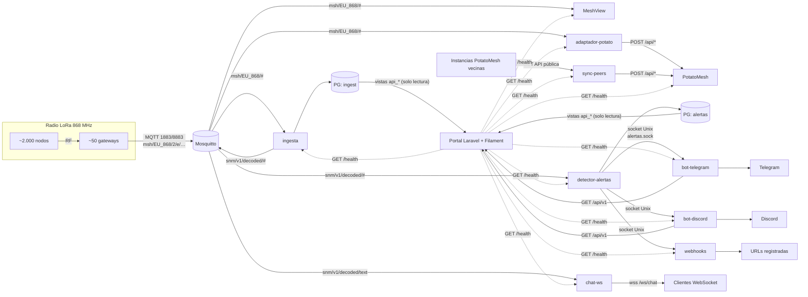

# Integración: cómo encaja todo

> Fuente única de los acuerdos entre piezas: hosts, redes, MQTT, flujo `decoded`, socket de alertas, bases de datos y vistas, API, salud y configuración común. Cada documento de pieza en `docs/info/` repite lo que necesita, pero si algo difiere, **manda este documento**. Cambiar un contrato = cambiar aquí primero y después en las fichas afectadas.

## 1. Mapa del sistema



## 2. Inventario de piezas

| Pieza | Tipo | Ficha | Directorio del monorepo | Contenedor(es) | Redes | Host público | Base de datos |
|---|---|---|---|---|---|---|---|
| Servidor, Nginx, PostgreSQL, Mosquitto | Infraestructura | `infrastructure/` | `infrastructure/` | Ninguno (Nginx, PostgreSQL y Mosquitto son nativos del host) | `mesh` (la crea) | — | Todas las bases |
| Broker MQTT | Comunidad (Mosquitto) | `mosquitto/` | `integrations/mosquitto/` | Nativo del host (`mosquitto.service`) | Host (`172.30.0.1:1884` hacia `mesh`) | `mqtt.mesh.example.org` | — |
| MeshView | Comunidad | `meshview/` | `integrations/meshview/` | `meshview` | `mesh` | `meshview.mesh.example.org` | `meshview` |
| PotatoMesh | Comunidad | `potatomesh/` | `integrations/potatomesh/` | `potatomesh` | `mesh` | `potato.mesh.example.org` | SQLite propio |
| adaptador-potato | Propio (Python) | `potatomesh/adaptador-potato.md` | `services/adaptador-potato/` | `adaptador-potato` | `mesh` | — | — |
| sync-peers | Propio (Python) | `potatomesh/sync-peers.md` | `services/sync-peers/` | `sync-peers` | `mesh` | — | `peersync` |
| ingesta | Propio (Python) | `ingesta/` | `services/ingesta/` | `ingesta` | `mesh` | — | `ingest` (TimescaleDB) |
| Portal (web, API, panel) | Propio (Laravel + Filament) | `portal/` | `services/portal/` | `portal` | `mesh` | `mesh.example.org` | `portal` + lectura de vistas |
| detector-alertas | Propio (Python) | `detector-alertas/` | `services/detector-alertas/` | `detector-alertas` | `mesh` | — | `alertas` |
| bot-telegram | Propio (Python) | `bots-webhooks/01-bot-telegram.md` | `services/bot-telegram/` | `bot-telegram` | `mesh` | — | `bot_telegram` |
| bot-discord | Propio (Python) | `bots-webhooks/02-bot-discord.md` | `services/bot-discord/` | `bot-discord` | `mesh` | — | `bot_discord` |
| webhooks | Propio (Python) | `bots-webhooks/03-webhooks.md` | `services/webhooks/` | `webhooks` | `mesh` | — | `webhooks` |
| chat-ws | Propio (Python) | `chat-ws/` | `services/chat-ws/` | `chat-ws` | `mesh` | `mesh.example.org/ws/chat` | — |

Total: 9 desarrollos propios, 2 piezas de comunidad (PotatoMesh, MeshView), y Nginx, PostgreSQL 17 + Mosquitto nativos del servidor.

## 3. Flujos

1. **Radio → broker.** Cada gateway publica lo que oye en `msh/EU_868/2/e/<canal>/<!id_gateway>` (protobuf `ServiceEnvelope`) y sus map reports en `msh/EU_868/2/map/`. La ACL solo acepta los 14 canales y el propio id del gateway. Nada vuelve a la radio: ningún gateway puede leer.
2. **Visores de comunidad.** MeshView lee `msh/EU_868/#` directamente. PotatoMesh no lee MQTT: lo alimenta `adaptador-potato` (lee `msh/EU_868/#`, descifra, deduplica y hace `POST` a su API) y `sync-peers` (copia de instancias vecinas).
3. **Datos propios.** `ingesta` lee `msh/EU_868/#`, descifra, decodifica, deduplica, asigna provincia, guarda en la base `ingest` y publica un mensaje por paquete único en `snm/v1/decoded/<portnum>`.
4. **Alertas.** `detector-alertas` lee `snm/v1/decoded/#`, evalúa reglas, clasifica (riesgo × tipo), guarda en la base `alertas` y emite cada transición por el socket Unix.
5. **Avisos.** `bot-telegram`, `bot-discord` y `webhooks` están conectados al socket, filtran por destino y envían. Guardan lo enviado en su base.
6. **Portal.** Sirve la web, la API pública `/api/v1` y el panel `/admin`. Lee **solo** las vistas `api_*` de `ingest` y `alertas` con roles de solo lectura (excepción documentada). Los bots usan esa API para sus comandos.
7. **Chat en directo.** `chat-ws` lee `snm/v1/decoded/text` y difunde por WebSocket los textos de difusión de cada canal admitido a quien se suscriba (`wss://mesh.example.org/ws/chat`). Solo lectura: nada vuelve a MQTT ni a la radio.
8. **Salud.** El panel comprueba cada minuto el `/health` interno de cada pieza.

## 4. Hosts, puertos y redes

### Hosts públicos

| Host | Destino | Puertos |
|---|---|---|
| `mesh.example.org` | Portal (web, `/api/v1`, `/admin`); `/ws/` → `chat-ws` | 443 (80 → 443) |
| `potato.mesh.example.org` | PotatoMesh | 443 |
| `meshview.mesh.example.org` | MeshView | 443 |
| `mqtt.mesh.example.org` | Mosquitto | 1883 (MQTT) y 8883 (MQTT con TLS terminado en Nginx `stream` → `127.0.0.1:1883`) |

DNS: `mesh.example.org` y `*.mesh.example.org` → IPv4 e IPv6 del servidor, **sin proxy de CDN**.

### Puertos publicados en el host

Solo `80`, `443`, `8883` (Nginx nativo) y `1883` (Mosquitto nativo), más SSH. Ningún contenedor publica en `0.0.0.0` (Docker se salta ufw); los que sirve Nginx publican solo en `127.0.0.1`:

| Contenedor | Local del host | Puerto del contenedor |
|---|---|---|
| `portal` | `127.0.0.1:8100` | 8080 |
| `chat-ws` | `127.0.0.1:8090` | 8000 |
| `potatomesh` | `127.0.0.1:41447` | 41447 |
| `meshview` | `127.0.0.1:8081` | 8081 |

 PostgreSQL (5432) y Mosquitto interno (1884) solo escuchan en `localhost` y en la puerta de la red `mesh` (`172.30.0.1`).

### Redes Docker

| Red | Subred | Quién | Para qué |
|---|---|---|---|
| `mesh` | **Fija `172.30.0.0/24`, puerta `172.30.0.1`** | Todos los servicios propios, portal, PotatoMesh, MeshView | Servicios del host (PostgreSQL `172.30.0.1:5432`, Mosquitto `172.30.0.1:1884`), API interna de PotatoMesh, `/health` |

### Volúmenes compartidos

| Volumen | Montado en | Contenido |
|---|---|---|
| `alertas-socket` (externo) | `detector-alertas` (escritura), `bot-telegram`, `bot-discord`, `webhooks` | `/run/snm/alertas.sock`. Se crea al desplegar el detector: `/run/snm` con propietario `10501:10500` y modo `2770`; los consumidores entran con `group_add: ["10500"]` |

El resto de volúmenes son propios de cada servicio (ver su ficha).

## 5. MQTT

| Listener | Puerto | Quién | Autenticación |
|---|---|---|---|
| Público | 1883 | Gateways | Usuario por gateway = su id (`!a1b2c3d4`) + contraseña |
| Público TLS | 8883 (Nginx `stream` → `127.0.0.1:1883`) | Gateways con TLS | Igual |
| Interno | 1884 (solo red `mesh`, `172.30.0.1:1884`) | Servicios | Usuario por servicio |
| Local | 1885 en `127.0.0.1` del host | Healthcheck y diagnóstico del host | Anónimo, solo lectura |

| Usuario | Permisos |
|---|---|
| `!<id>` (cada gateway) | Escritura en `msh/EU_868/2/e/<canal>/<!id>` para cada canal de `ALLOWED_CHANNELS` y en `msh/EU_868/2/map/#`. Sin lectura |
| `svc-meshview` | Lectura `msh/EU_868/#` |
| `svc-potato` | Lectura `msh/EU_868/#` |
| `svc-ingest` | Lectura `msh/EU_868/#`; escritura `snm/v1/decoded/#` |
| `svc-detector` | Lectura `snm/v1/decoded/#` |
| `svc-chatws` | Lectura `snm/v1/decoded/text` |
| `svc-panel` | Ningún permiso de topic: solo conecta (comprobación de salud desde el panel) |

| Topic | Productor | Consumidores | Contenido |
|---|---|---|---|
| `msh/EU_868/2/e/<canal>/<!id>` | Gateways | MeshView, adaptador-potato, ingesta | `ServiceEnvelope` protobuf |
| `msh/EU_868/2/map/` | Gateways | MeshView, ingesta | Map report (`MAP_REPORT_APP`) |
| `snm/v1/decoded/<portnum>` | ingesta | detector-alertas; `text` también chat-ws | JSON (sección 6) |

`max_packet_size` 16384 (cabe el JSON `decoded`). No existen topics de estado (el firmware no publica LWT), ni JSON del firmware, ni topics públicos de eventos. El chat se publica por WebSocket, no por MQTT.

## 6. Flujo `decoded`

Un mensaje por **paquete único**, publicado al cerrar una ventana de 2 s tras la primera recepción. QoS 0, sin retained. `<portnum>` en minúsculas sin sufijo: `nodeinfo`, `position`, `telemetry`, `text`, `neighborinfo`, `traceroute`, `routing`, `map_report`, `other`.

```json
{
  "v": 1,
  "packet_id": 3735928559,
  "from": "!a1b2c3d4",
  "from_node": {"short": "CAD1", "long": "Repetidor Sierra Cádiz", "role": "ROUTER", "hw": "HELTEC_V3", "is_gateway": false, "province": "ES-CA"},
  "to": "^all",
  "portnum": "telemetry",
  "channel": "SFNarrow",
  "rx_first": "2026-10-01T15:00:00Z",
  "hop_start": 3,
  "hops_min": 1,
  "via_mqtt": false,
  "ok_to_mqtt": true,
  "airtime_ms": 231.9,
  "receptions": [
    {"gateway": "!0badc0de", "snr": 6.5, "rssi": -98, "hops": 1, "at": "2026-10-01T15:00:00Z"}
  ],
  "payload": {
    "device_metrics": {"battery_level": 37, "voltage": 3.61, "channel_utilization": 18.2, "air_util_tx": 2.1, "uptime_seconds": 84}
  }
}
```

- `from_node` sale del registro de nodos de `ingesta` (último nodeinfo, posición y si el nodo ha publicado alguna vez como gateway). Así el detector conoce rol, nombres y provincia sin leer otra base. Campos desconocidos van a `null`.
- `channel` es el nombre del topic en forma canónica (sin tildes). `PRIMARY_CHANNEL` es siempre el canal 0.
- `payload` lleva el contenido decodificado según el tipo, con los nombres de campo del protobuf en snake_case (p. ej. `latitude_i`, `longitude_i`); para tipos no decodificados va `{}`. Detalle por tipo en `ingesta/06-decoded-stream.md`.
- Excepciones: `map_report` lleva `channel: null` y `airtime_ms: 0` (no ocupa radio); los paquetes PKI (mensajes directos) no se publican; los que no se pueden descifrar se publican como `other` con `payload: {}`.
- `airtime_ms` de ejemplo: 231,9 ms = 56 B de carga con SFNarrow.

## 7. Socket de alertas

| Elemento | Valor |
|---|---|
| Ruta | `/run/snm/alertas.sock` (volumen `alertas-socket`) |
| Tipo | Unix `SOCK_STREAM`; servidor: `detector-alertas`; varios clientes |
| Permisos | `0660`, GID `10500` (`ALERTAS_SOCKET_GID`), que comparten los consumidores |
| Formato | NDJSON UTF-8, un objeto por línea |

1. El cliente envía un saludo en menos de 10 s: `{"cliente": "bot-telegram", "desde": "<transicion_id> | null"}`. `desde: null` = solo directo. Saludo inválido o ausente → el detector cierra la conexión.
2. El detector reenvía desde su base las transiciones posteriores a `desde` (máximo 24 h) y sigue en directo.
3. Cada transición: `{"v": 1, "transicion_id": "<ULID>", "transicion": "abierta|actualizada|resuelta", "alerta": {…}}`.
4. Latido cada 30 s: `{"latido": "<ISO 8601>"}`. Sin latido en 90 s, el cliente reconecta con su último `transicion_id`.
5. Cliente con más de 1.000 mensajes sin leer → desconectado; recupera al reconectar.
6. Una reapertura (la misma condición vuelve antes de 1 h) es una transición `abierta` con un `alerta.id` ya conocido.

Objeto `alerta` (claves en español, internas):

```json
{
  "id": "01JABCDXYZ7Q8R9S0T1V2W3X4Y",
  "regla": "reboot-loop",
  "riesgo": "alto",
  "tipo": "infraestructura",
  "mensaje": "CAD1 se ha reiniciado 7 veces en la última hora",
  "nodo": "!a1b2c3d4",
  "nodos": [],
  "nodo_info": {"corto": "CAD1", "largo": "Repetidor Sierra Cádiz", "rol": "ROUTER", "provincia": "ES-CA"},
  "datos": {"reinicios": 7, "ventana_min": 60},
  "estado": "abierta",
  "abierta_en": "2026-10-01T15:00:00Z",
  "actualizada_en": "2026-10-01T15:42:00Z",
  "resuelta_en": null
}
```

`nodo` es `"all"` cuando la alerta afecta a muchos nodos; entonces `nodos` lleva la lista y `nodo_info` va a `null`.

## 8. PostgreSQL

PostgreSQL 17 nativo del servidor con TimescaleDB. Conexión desde contenedores: `172.30.0.1:5432`, `scram-sha-256`, solo desde `172.30.0.0/24`.

| Base | Propietario (rol) | Servicio | Notas |
|---|---|---|---|
| `portal` | `portal` | Portal | Usuarios del panel, sesiones, caché, colas, estado de servicios |
| `meshview` | `meshview` | MeshView | Esquema propio de MeshView (migraciones Alembic) |
| `ingest` | `ingest` | ingesta | Extensión `timescaledb` |
| `alertas` | `alertas` | detector-alertas | |
| `peersync` | `peersync` | sync-peers | |
| `bot_telegram` | `bot_telegram` | bot-telegram | |
| `bot_discord` | `bot_discord` | bot-discord | |
| `webhooks` | `webhooks` | webhooks | |

Roles de solo lectura (únicas lecturas cruzadas permitidas):

| Rol | Puede leer | Usado por |
|---|---|---|
| `portal_lector_ingesta` | `SELECT` sobre las vistas `api_*` de `ingest` y nada más | Portal |
| `portal_lector_alertas` | `SELECT` sobre las vistas `api_*` de `alertas` y nada más | Portal |

### Vistas contrato de `ingest`

| Vista | Una fila por | Columnas clave | Usada en |
|---|---|---|---|
| `api_nodes` | Nodo | `id`, `short_name`, `long_name`, `role`, `hw_model`, `firmware`, `province`, `last_position_at`, `position_precision_m`, `border_uncertain`, `hop_start_last`, `is_gateway`, `first_seen`, `last_seen` | Mapa, búsqueda, diagnóstico |
| `api_province_load` | Nodo con provincia y rol router, `CLIENT` o `CLIENT_BASE` (sin `CLIENT_MUTE`) | `node_id`, `province`, `role`, `grupo` (`router`, `cliente`), `channel_utilization`, `measured_at` (último dato de 12 h) | Saturación del mapa, `summary` |
| `api_routers` | Router (roles de `INFRA_ROLES`) visto en 7 días | `id`, nombres, `role`, `province`, `battery_level`, `voltage`, `battery_at`, `channel_utilization`, `air_util_tx`, `metrics_at`, `last_seen` | `/routers`, `/battery`, `/status` |
| `api_gateways` | Gateway | `id`, nombres, `last_message_at`, `typical_interval_s`, `packets_last_hour`, `unique_nodes_24h` | Panel, `summary` |
| `api_summary` | — (una fila) | `nodes_active_24h`, `nodes_active_7d`, `routers_active_24h`, `gateways_publishing` (mensaje en los últimos 15 min), `packets_last_hour`, `generated_at` | `summary` |
| `api_traffic_mix` | Periodo (hora, día, semana, mes) × tipo de paquete | `bucket_start`, `granularity`, `portnum`, `packets`, `airtime_s` | `traffic-mix` |
| `api_rank_<id>` | Periodo × nodo, gateway o provincia | `bucket_start`, `granularity` (`hour`, `day`, `week`, `month`, en hora de Madrid), `subject_id`, `value`, `extra` (JSON: desglose) | Rankings. La vista ya trae semana y mes (no se suman días en el portal: hay recuentos distintos y medias) |
| `api_node_intervals` | Nodo × tipo × variante (7 días) | `node_id`, `portnum`, `variant` (p. ej. `device_metrics`, `environment_metrics`, `local_stats`), `broadcasts`, `median_interval_s` | Revisa tu nodo |
| `api_node_battery_daily` | Nodo × día (7 días) | `node_id`, `day`, `min_level`, `avg_level`, `readings`, `readings_below_40` | Revisa tu nodo |
| `api_node_reboots_daily` | Nodo × día (7 días) | `node_id`, `day`, `reboots` | Revisa tu nodo |

Retención que deben respetar las vistas (política de privacidad, `portal/10-legal-privacy.md`): datos en bruto 30 días (posiciones y telemetría 90), agregados **por nodo** 1 año, agregados sin nodo indefinidos.

### Vistas contrato de `alertas`

Columnas exactas en `detector-alertas/03-socket-persistence.md` (incluye `riesgo_orden`, que la API usa para `min_risk`). Columnas exactas de `ingest` en `ingesta/05-contract-views.md`.

| Vista | Una fila por | Usada en |
|---|---|---|
| `api_alertas` | Alerta (abierta o resuelta, 1 año) | `/alerts`, páginas de alertas, panel |
| `api_alertas_transiciones` | Transición | `/alerts/{id}` (historial) |
| `api_alertas_resumen` | Riesgo × tipo (abiertas) | `summary`, portada |
| `api_nodos_en_riesgo` | Nodo con alertas abiertas | `/nodes/at-risk` |
| `api_catalogo` | Riesgo, tipo o regla | `/alerts/catalog`, filtros de los bots |

## 9. API pública (portal, Laravel)

Base: `https://mesh.example.org/api/v1` (`PORTAL_API_URL`). Solo `GET`, sin autenticación, sin cookies, CORS abierto, 60 peticiones/min por IP. Claves JSON en inglés; los valores de riesgo y tipo son los del catálogo (`bajo`, `medio`, `alto`; `infraestructura`, `clientes`).

| Endpoint | Fuente | Consumidores |
|---|---|---|
| `/stats/summary` | `api_summary`, `api_province_load`, `api_alertas_resumen` | Portada, `/status` de los bots |
| `/stats/provinces?window=24h\|7d\|30d` | `api_nodes`, `api_province_load` | Mapa |
| `/stats/rankings`, `/stats/rankings/{id}?period=hour\|day\|week\|month&which=current\|previous` | `api_rank_<id>` | Página de rankings |
| `/stats/traffic-mix?period=` | `api_traffic_mix` | Rankings |
| `/routers?province=&sort=` | `api_routers` | `/battery`, `/routers` de los bots |
| `/nodes?search=` | `api_nodes` | Revisa tu nodo |
| `/nodes/{id}/diagnosis` | `api_nodes`, `api_node_*`, `api_rank_network_usage`, `api_alertas` | Revisa tu nodo |
| `/nodes/at-risk?province=&min_risk=&type=` | `api_nodos_en_riesgo` | Rankings, portada |
| `/alerts?state=&risk=&type=&province=&node=&since=&limit=&cursor=` | `api_alertas` | Página de alertas |
| `/alerts/{id}` | `api_alertas`, `api_alertas_transiciones` | Ficha de alerta (enlace de los bots) |
| `/alerts/catalog` | `api_catalogo` | Bots, página de bots, filtros |

Correspondencia de claves del objeto alerta (socket → API): `regla→rule`, `riesgo→risk`, `tipo→type`, `mensaje→message`, `nodo→node`, `nodos→nodes`, `nodo_info→node_info` (`corto→short`, `largo→long`, `rol→role`, `provincia→province`), `datos→data`, `estado→state` (`abierta→open`, `resuelta→resolved`), `abierta_en→opened_at`, `actualizada_en→updated_at`, `resuelta_en→resolved_at`.

## 10. API de PotatoMesh (interna)

`http://potatomesh:41447` en la red `mesh`. Escritura con `Authorization: Bearer ${POTATOMESH_API_TOKEN}`, solo desde `adaptador-potato` y `sync-peers`. Endpoints usados: `/api/nodes`, `/api/positions`, `/api/telemetry`, `/api/messages`, `/api/traces`, `/api/neighbors` (detalle en `potatomesh/`).

## 11. Salud

| Pieza | Comprobación del panel |
|---|---|
| Servicios propios en Python | `GET http://<contenedor>:8080/health` → `200` con JSON `{"ok": true, …}` |
| Portal | Su propia tarea programada (si no corre, el panel lo indica) |
| PotatoMesh | `GET http://potatomesh:41447/version` |
| MeshView | `GET http://meshview:<puerto>/health` |
| Mosquitto | Conexión TCP a `172.30.0.1:1884` con usuario de solo lectura del panel (`svc-panel`, sin permisos de topic) |
| PostgreSQL | `SELECT 1` con la conexión del portal |

Todos los servicios propios exponen además su `/health` en el puerto 8080 **solo en la red `mesh`**.

## 12. Configuración común (`.env.comun`)

Un archivo en el servidor (`/srv/comun/.env`) que cada `compose.yaml` carga con `env_file` antes del `.env` propio. Ningún valor de esta tabla se escribe en el código.

| Variable | Valor | Usan |
|---|---|---|
| `PROJECT_NAME` | `Sur Nodos en Mallas` | Todos |
| `PROJECT_DOMAIN` | `mesh.example.org` | Todos |
| `PROJECT_CONTACT` | `public@raupulus.dev` | Portal, bots, sync-peers (User-Agent) |
| `TZ` | `Europe/Madrid` | Todos (periodos de rankings en hora local) |
| `MQTT_HOST` / `MQTT_PORT` | `172.30.0.1` / `1884` | Servicios MQTT |
| `MQTT_TOPIC_ROOT` | `msh/EU_868` | ingesta, adaptador-potato, MeshView, broker (ACL) |
| `MQTT_TOPIC_PREFIX` | `snm` | ingesta, detector |
| `ALLOWED_CHANNELS` | `SFNarrow,Iberia,Andalucia,Cadiz,Huelva,Almeria,Granada,Jaen,Sevilla,Cordoba,Malaga,Ceuta,Melilla,sos` | Broker (ACL), ingesta, adaptador-potato, sync-peers, chat-ws |
| `PRIMARY_CHANNEL` | `SFNarrow` | Ídem, y chat-ws |
| `CHANNEL_KEY_DEFAULT` | `AQ==` (clave pública por defecto, no es secreto) | ingesta, adaptador-potato |
| `INFRA_ROLES` | `ROUTER,ROUTER_LATE,REPEATER` | ingesta (vistas), detector (clasificación), portal |
| `SATURACION_PESO_ROUTERS` / `SATURACION_PESO_CLIENTES` | `0.6` / `0.4` | Portal (mapa, `summary`), detector (`chutil-high`) |
| `LORA_REGION`, `LORA_BANDWIDTH`, `LORA_SPREAD_FACTOR`, `LORA_CODING_RATE`, `LORA_FREQUENCY_SLOT`, `LORA_FREQUENCY_MHZ`, `LORA_HOP_LIMIT` | `EU_868`, `62`, `7`, `5`, `4`, `869.618`, `3` | Portal, ingesta (tiempo de aire) |
| `MESHTASTIC_PRESET` / `MESHTASTIC_FREQ` | `#SFNarrow` / `868MHz` | PotatoMesh (nombres de sus variables) |
| `MAP_CENTER` / `MAP_ZOOM` | `36.48,-5.85` / `9` | PotatoMesh, portal |
| `DB_HOST` / `DB_PORT` | `172.30.0.1` / `5432` | Servicios con base de datos |
| `ALERTAS_SOCKET` / `ALERTAS_SOCKET_GID` | `/run/snm/alertas.sock` / `10500` | Detector, bots, webhooks |
| `PORTAL_API_URL` | `https://mesh.example.org/api/v1` | Bots |

Variables propias de cada servicio (en su `.env`, nunca en git): `MQTT_USER`, `MQTT_PASSWORD`, `DB_NAME`, `DB_USER`, `DB_PASSWORD`, tokens (`POTATOMESH_API_TOKEN`, `TELEGRAM_BOT_TOKEN`, `DISCORD_BOT_TOKEN`), secretos de webhooks. Cada ficha las lista.

## 13. Definiciones compartidas

| Término | Definición única |
|---|---|
| Router | Nodo con rol en `INFRA_ROLES` (`ROUTER`, `ROUTER_LATE`, `REPEATER`) |
| Nodo de infraestructura | Router o gateway (nodo que ha publicado en el broker con su usuario) |
| Gateway | Nodo con usuario en el broker; su id aparece al final del topic |
| Id de nodo | `!` + 8 hexadecimales en minúsculas (`!a1b2c3d4`) |
| Provincia | ISO 3166-2: `ES-AL`, `ES-CA`, `ES-CO`, `ES-GR`, `ES-H`, `ES-J`, `ES-MA`, `ES-SE`; fuera de Andalucía `FUERA` |
| Riesgo | `bajo`, `medio`, `alto` (ampliable en `clasificacion.yaml`) |
| Tipo de aviso | `infraestructura`, `clientes` (ampliable) |
| Carga de canal | `channel_utilization` (%) de la telemetría de dispositivo; último dato de cada nodo en 12 h |
| Saturación de provincia | Nodos con posición en la provincia, separados en dos grupos: routers (`INFRA_ROLES`) y clientes (`CLIENT` y `CLIENT_BASE` juntos, una sola media); `CLIENT_MUTE` no cuenta. Media de cada grupo y suma ponderada: 0,6 × media de routers + 0,4 × media conjunta de `CLIENT` y `CLIENT_BASE`. Si un grupo no tiene datos, su peso se reparte en proporción entre los que sí tienen; sin ningún dato = sin datos. Niveles: verde ≤ 20, naranja > 20 y < 40, rojo ≥ 40 |
| Ids de alertas y transiciones | ULID |
| Fechas | ISO 8601 en UTC en todos los contratos; la web muestra hora de Madrid |

## 14. Dependencias y fallos

| Si cae… | Efecto | Recuperación |
|---|---|---|
| Mosquitto | Nada nuevo entra; la web sigue con lo guardado | Los consumidores reconectan solos |
| ingesta | Sin datos nuevos en mapa, rankings y alertas | Retoma desde el broker; lo perdido mientras estuvo caída no se recupera |
| detector-alertas | Sin alertas nuevas; la API sirve las guardadas | Los clientes del socket reconectan y recuperan 24 h |
| Un bot o webhooks | No salen avisos por ese canal | Recupera lo pendiente con su cursor |
| chat-ws | Sin chat en directo; los clientes se desconectan | Reconectan y reciben el historial en memoria (vacío si el servicio se reinició) |
| Portal | Sin web, API ni panel; los bots no responden comandos (las alertas siguen) | — |
| PotatoMesh | El adaptador encola (10.000) y reintenta | Se vacía la cola al volver |
| PostgreSQL | Fallan ingesta, detector, portal, bots | Reintentos con espera; nadie pierde lo que tiene en memoria salvo la ingesta en curso |
| El servidor entero | Todo caído, sin aviso (limitación aceptada) | Restauración con las copias del operador (fuera del proyecto) |

## 15. Orden de despliegue

1. `infrastructure` (servidor, Docker, red `mesh`, Nginx y certbot, PostgreSQL).
2. `mosquitto`.
3. `meshview` y `potatomesh` (visualización inmediata).
4. `ingesta`.
5. `portal` (web, API de estadísticas y panel).
6. `detector-alertas` (y endpoints de alertas del portal).
7. `bots-webhooks`.
8. `chat-ws` (necesita la ingesta).

Cada pieza se puede volver a desplegar sola sin parar las demás.

## 16. Monorepo

```text
infrastructure/       host/ (sistema), nginx/ (sitios, stream e install.sh), postgresql/ (roles, bases, extensiones, pg_hba), common/.env.example, deploy.sh, check-compose.sh
integrations/         mosquitto/, potatomesh/, meshview/   ← referencia + versión fijada + configuración propia; nunca su código
services/             portal/, ingesta/, detector-alertas/, bot-telegram/, bot-discord/, webhooks/, adaptador-potato/, sync-peers/, chat-ws/
```

- Cada directorio tiene su `compose.yaml`, `.env.example`, `README.md` y se despliega por separado en `/srv/<nombre>/`.
- Imágenes de terceros con versión fijada (la última probada); se actualizan a mano tras probarlas.
- Imágenes propias construidas en el servidor desde el `Dockerfile` de cada servicio (`docker compose build`); sin CI ni registro de imágenes. Despliegue con `deploy.sh <nombre>` (`infrastructure/04-operations.md`).
- Sin secretos ni `.env` reales en git. Commits sin firmas de atribución de herramientas.

---
> Creado: 2026-10-07 · Última revisión: 2026-10-07
